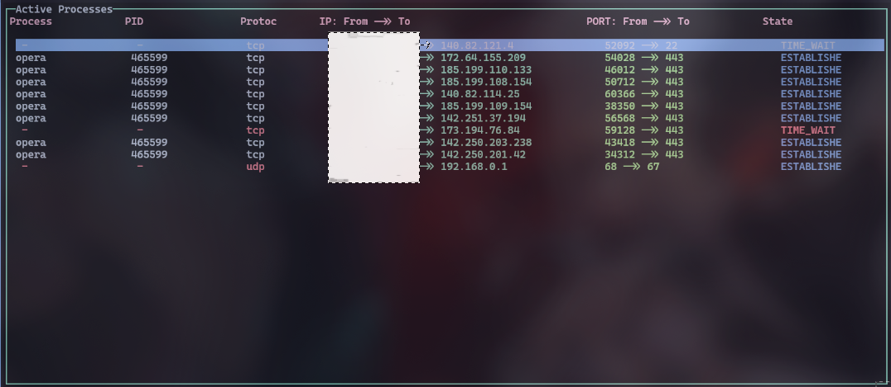

# pdisplay

## Deskription

A simple CLI tool created with node.js that imitates the behaviour of other tools like lsof or ps, it is more focused on wireless connections ans port identification for each running service.
It gives you the option to kill a process or not; you can navigate using the arrow keys and then press "ok" button to kill that process.

## Perquisites

**NOTE:** If you have the **latest** node version on your local machine you can ignore the next prequisite.

- Docker _enabled_ and _started_

```bash
sudo pacman -S docker
sudo systemctl enable docker
sudo systemctl start docker
```

## Output



## Installation

Simply clone this repo

```bash
git clone https://github.com/ignorant05/pdisplay.git
```

## Usage

If you have node already on your local machine then just jump into it:

```bash
npm i -g pdisplay # or use npm link to create a symlink on your local machine
pdisplay
```

However if you are using docker, then:

```bash
cd pdisplay
sudo docker run pdisplay
```

Optionally you can add flags and specify ports, but i don't find it necessary here.
